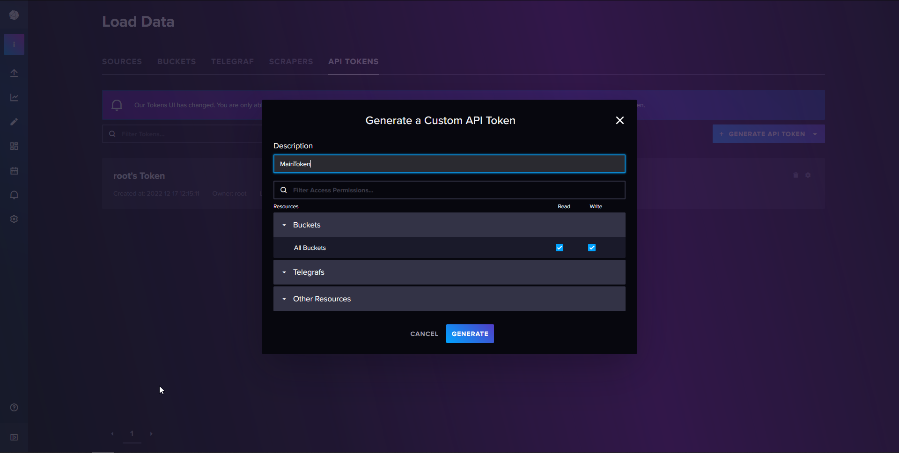
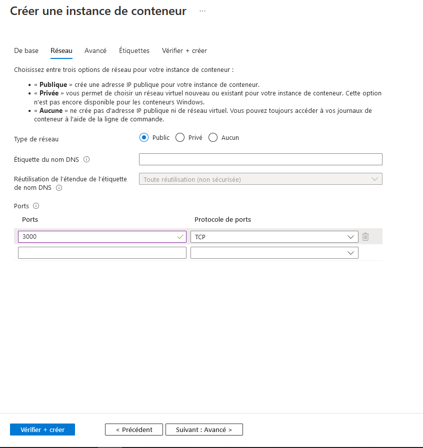

# IoT-smart-grid <!-- omit from toc -->

**Jade Gröli & David González León**

---

- [1. Introduction](#1-introduction)
- [2. Architecture](#2-architecture)
- [3. Étapes de développement](#3-étapes-de-développement)
  - [3.1. Partie récupération des données des capteurs et visualisation](#31-partie-récupération-des-données-des-capteurs-et-visualisation)
  - [3.2. Partie prédiction](#32-partie-prédiction)
  - [3.3. Partie entraînement du modèle et redéploiement](#33-partie-entraînement-du-modèle-et-redéploiement)
- [4. Déploiement de toute l'application](#4-déploiement-de-toute-lapplication)
  - [4.1. Déploiement de l'application de visualisation des données](#41-déploiement-de-lapplication-de-visualisation-des-données)
    - [4.1.1. InfluxDB](#411-influxdb)
    - [4.1.2. Grafana](#412-grafana)
    - [4.1.3. Application sur le Raspberry Pi](#413-application-sur-le-raspberry-pi)
    - [4.1.4. Résultats sur la dashboard Grafana](#414-résultats-sur-la-dashboard-grafana)
  - [4.2. Déploiement de l'application de prédiction et du azure hub](#42-déploiement-de-lapplication-de-prédiction-et-du-azure-hub)
    - [4.2.1. Déploiement des composants Azure](#421-déploiement-des-composants-azure)
    - [4.2.2. Déploiement sur le Raspberry Pi](#422-déploiement-sur-le-raspberry-pi)
    - [4.2.3. Génération de l'image docker](#423-génération-de-limage-docker)
- [5. Estimation de coûts](#5-estimation-de-coûts)
- [6. Sources](#6-sources)

---

# 1. Introduction

Ce projet consiste à développer un système IoT pour une application Smart Grid.

L'application se divise en deux fonctionnalités. La première consiste à récupérer les données des capteurs de mesure de consommation d’énergie fournis par un device [Clemap](https://en.clemap.com/products/clemap-energy-monitor) et à offrir à un utilisateur une interface de visualisation de ces données en se connectant à cette interface avec son propre appareil. La seconde consiste à prédire les résultats à partir des données reçues des capteurs. Si ces prédictions sont incorrectes par rapport aux résultats reçus par la suite, le modèle est re-entraîné et mis à jour.

# 2. Architecture

Des capteurs collectent des données telles que la tension et l'intensité d'un réseau Smart Grid. Ces données sont envoyées un à Broker MQTT se situant sur un Raspberry pi. Ces capteurs sont donc des publishers pour le Broker MQTT. Deux programmes/logiciels souscrivent à ce broker.

Le premier est un programme qui se charge de récupérer les données en temps réel des capteurs. Les capteurs collectent des données à une fréquence de 12 Hz. La base de données ne doit insérer des données qu'une fois par minute. Une moyenne des données reçue est donc effectuée et c'est cette moyenne qu'on insère. Ces données doivent être visualisées à l'aide d'une dashboard par exemple. La base de données et le programme qui s'occupe de la visualisation sont localisés sur un cloud. InfluxDB est utilisé comme base de données et Grafana comme dashboard.

Le second programme se charge de faire des prédictions sur les données reçues. Ces prédictions sont faites à l'aide d'un modèle de machine learning fourni. Les prédictions doivent être récupérées et analysées. Les données prédites sont comparées avec les données réelles et si la différence est trop grande, un triplet contant la donnée prédite, la données réelle et la donnée fournie pour effectuer la prédiction est envoyé sur un cloud. Ce cloud stocke ces différents triplets et au bout d'un certain nombre de prédictions, il re-entraîne le modèle utilisé pour les prédictions dans le premier logiciel. Ce nouveau modèle est ensuite envoyé au premier logiciel pour qu'il puisse mettre à jour son modèle.

Le schéma de l'architecture est le suivant :


# 3. Étapes de développement

Pour le développement de notre application, nous nous sommes d'abord focalisés sur les deux applications qui s'exécutent sur le Raspberry pi. Nous avons donc commencé par la partie récupération des données des capteurs et visualisation. Une fois cette partie terminée, nous avons commencé la partie prédiction.

Nous avons testé tout le code en natif avant d'effectuer le déploiement de l'architecture complète sur azure.

## 3.1. Partie récupération des données des capteurs et visualisation

Cette partie se trouve dans le dossier "DataApp". "DataApp.py" se charge de se connecter au broker MQTT et de récupérer les données. Ces données reçues dans une payload sont décodées pour pouvoir être manipulées, le décodeur se trouve dans le fichier "mqtt_payload_decoder.py". Une fois les données décodées, elles sont mise sous la formatées pour pouvoir être insérées dans la base de données InfluxDB. Dans la base de données, les données sont stockées dans un même bucket.
Grafana récupère les différentes données de ce bucket et se charge de leur visualisation dans un dashboard.

## 3.2. Partie prédiction

Cette partie se trouve dans le dossier "mlApp". Pour l'application tournant sur le pi, il s'agira d'un container docker, qui sera redéployé à chaque fois que le modèle est mis à jour.

Les données des capteurs sont récupérées et décodée de la même manière que la partie visualisation, mais toutes les 10 secondes et non pas toutes les minutes. Une prédiction est ensuite effectuée pour connaître le résultat de la consommation futur. La partie ML contient un modèle qui prend en entrée les puissances des trois phases, ainsi que leurs sommes et le timestamp. Le modèle prédit la sommes des puissances des trois phases dans les 10 secondes suivantes. Ce modèle est appelé dans le fichier "mlApp/src/mlFunctions.py" et se trouve dans le fichier "model_xgboost.json".

Une fois la prédiction effectuée, l'application dans le fichier "mlApp.py" enregistrera la donnée prédite, et attendra le prochain message du broker MQTT. Une fois reçue, elle comparera la valeur prédite avec la valeur réelle. Si celle-ci est correcte il ne fera rien. Si celle-ci est fausse il enregistrera le triplet (prédiction, valeur réelle, timestamp) dans un fichier json situé sur un blob storage sur azure.

Actuellement la prédiction est faite toutes les 10 secondes pour faciliter le développement du modèle et de l'application. Une fois que la structure du modèle sera définitive, la fréquence de prédiction pourra être passée à 1 minute, pour rester cohérent avec la fréquence de visualisation des données.

## 3.3. Partie entraînement du modèle et redéploiement

Dans le cloud, une application s'occupera d'automatiquement entraîner le modèle périodiquement ou une fois que suffisamment de données erronées seront enregistrées. Une fois le modèle entraîné, il sera redéployé sur un container stocké par Azure IoT Hub, qui fera automatiquement le redéploiement vers le raspberry pi.

Pour l'instant, ce déploiement se fait manuellement car la création de l'application cloud permettant d'automatiser n'est pas demandée dans ce projet.

# 4. Déploiement de toute l'application

Pour le déploiement de l'application, nous avons utilisé les services Azures. Nous avons créé un groupe de ressources Azure qui contient tous les services nécessaires au fonctionnement de l'application.

Une fois le groupe de ressources créé, nous avons d'abord déployé la partie récupération et visualisation des données, puis la partie prédiction/entraînement du modèle.

## 4.1. Déploiement de l'application de visualisation des données

Nous avons déployé les 2 composants sur Azure :

-   Influx DB : Nous avons déployé la base de données InfluxDB sur Azure en utilisant le service de container d'Azure. Nous voulions utiliser le service InfluxDB Azure mais nous n'avons pas réussi à le faire fonctionner car nous ne pouvions pas prendre un abonnement SaaS en tant qu'étudiant.
-   Grafana : pour les même raisons qu'InfluxDB, nous avons déployé Grafana sur Azure en utilisant le service de container d'Azure.

Une fois les 2 composants déployés nous avons configuré InfluxDB et Grafana pour qu'ils puissent communiquer ensemble. Nous avons ensuite importé le dashboard que nous avions créé localement dans Grafana.

Les étapes de déploiements sont les suivantes :

### 4.1.1. InfluxDB

On crée un nouveau container au sein du groupe de ressources Azure. On lui fournit les informations suivantes :


Une fois le container déployé, on peut se connecter à l'interface web de InfluxDB en utilisant l'adresse IP du container et le port 8086.


Une fois connecté, il faut configurer la base de données en créant une organisation et un bucket correspondant aux noms présents dans la fonction Azure (iot_agriculture et iot_bucket dans notre cas). Il faut ensuite créer un nouveau token pour donner les droits d'écriture à la fonction Azure et Grafana.



On copie le token qui sera utilisé pour configurer Grafana et l'application tournant sur le Raspberry Pi.

### 4.1.2. Grafana

On crée un nouveau container au sein du groupe de ressources Azure. On lui fournit les informations suivantes :




Une fois le container déployé, on peut se connecter à l'interface web de Grafana en utilisant l'adresse IP du container et le port 3000. On se connecte avec le compte admin/admin. On ajoute ensuite la source de données InfluxDB en utilisant les informations suivantes avec l'adresse IP du container InfluxDB :


Une fois ceci effectué, on importe la dashboard à l'aide du fichier json fourni.

### 4.1.3. Application sur le Raspberry Pi

Pour lancer l'application sur le raspberry pi, il faut d'abord installer les dépendances nécessaires. Pour cela il faut exécuter la commande suivante à la racine du dossier `src/DataApp` :

```bash
pip3 install -r requirements.txt
```

A noter que la version de python doit être 3.7 ou supérieure pour que l'application puisse marcher. Une fois les dépendances installées il faut créer et modifier le fichier de configuration `config.json` à la racine du dossier `src/DataApp` en utilisant le fichier `config.json.example` comme modèle. Votre fichier `config.json` devrait ressembler à ceci :

```json
{
    "influxdbUrl": "http://20.250.208.244:8086",
    "influxdbToken": "2cN7PV9WYqiH7oR-ssA9lQgJyQ6MavCz3z3DlM6d6kPjsmr5dTHhEviNnk3dVz6FLc7u2GNkSMTbP92HKOAEYA==",
    "influxdbOrg": "iot_smart_grid",
    "influxdbBucket": "iot_bucket",
    "influxdbMeasurement": "iot_measurement"
}
```

Il faut ensuite lancer l'application avec la commande suivante :

```bash
python3 main.py
```

### 4.1.4. Résultats sur la dashboard Grafana

Une fois le déploiement terminé et quelques données reçues, on observe le résultat suivant sur le dashboard Grafana :


## 4.2. Déploiement de l'application de prédiction et du azure hub

Cette partie détaille la mise en place du réentrainement du modèle de prédiction et du déploiement des différents composants Azure nécessaires à son fonctionnement. Ce nouveau modèle est renvoyé vers le Rasberry Pi dans une image Docker qui est ensuite redéployé sur le Rasberry Pi. Ce redéploiement se fait automatiquement à chaque fois que le modèle est mis à jour.

### 4.2.1. Déploiement des composants Azure

Pour cette étape, nous avons créé dans Azure les composants suivants :

-   Un IoT Hub : c'est le service qui nous permettra de connecter notre device au cloud azure, afin de pouvoir envoyer les données de notre device vers le cloud.
-   Un compte de stockage : c'est le service qui nous permettra de stocker les données que nous allons envoyer depuis notre device, dans notre cas les données obtenues lors de prédictions fausses.
-   Un registre de conteneurs : c'est ici que l'image docker de l'application sera mise en ligne, afin de pouvoir la déployer sur les device.

Sous l'interface Azure, on ajoute un IoT Hub au groupe de ressource. On ajoute ensuite notre device à ce IoT Hub.

Une fois le device ajouté, il faut créer une route pour pouvoir router les messages vers un point de terminaison. Dans notre cas, c'est un conteneur de stockage Azure. Ce conteneur se trouve dans un compte de stockage Azure.

Le re-entraînement du modèle se fait dans une machine virtuelle également rattachée au groupe de ressource Azure. Cette machine virtuelle récupère les données du conteneur de stockage Azure, les traite et re-entraîne le modèle. Un nouveau conteneur est ensuite créé avec la nouvelle version du modèle. Dans notre cas, seul le registre de conteneur contenant l'image mise à jour a été créé car nous ne nous occupons pas de re-entraîner le modèle.

### 4.2.2. Déploiement sur le Raspberry Pi

Nous n'avons pas pu effectuer le déploiement sur le Raspberry Pi à cause de problèmes de version de l'OS, qui nous empêchait d'installer l'utilitaire de device edge d'azure. Une fois ce problème résolu, il suffirait uniquement d'installer l'utilitaire de device edge d'azure sur le Raspberry Pi et de paramétrer le redéploiement automatique de l'application grâce à l'image générée.

A cause du même problème d'OS, nous n'avons pas pu tester la prédiction, car la librairie utilisée (`xgboost`) n'est pas compatible avec l'os du Raspberry Pi actuelle (`raspbian stretch`).

Pour tester cependant le bon fonctionnement de l'application, nous avons fait tourner en natif le code, sans utiliser la prédiction. Nous avons ensuite vérifié que le routage marchait correctement, et que nos messages étaient bien stockés dans le conteneur de stockage Azure.


### 4.2.3. Génération de l'image docker

Comme mentionné précédemment nous n'avons pas pu tester le redéploiement automatique de l'image sur le raspberry pi. Nous avons cependant testé que nous arrivions correctement à générer une image docker avec notre application de prédiction. Nous avons pour cela utilisé les extensions pour Azure de VS code, et avons effectué le déploiement.


L'image était ensuite construite par azure et déployée dans notre registre de conteneurs.


Nous avons ensuite vérifié que le raspberry pi pouvait bien récupérer l'image depuis le registre de conteneurs en effectuant un `docker pull imageName` sur le raspberry pi. Nous n'avons cependant pas réussi à la lancer, à cause des problèmes de version d'OS mentionnés précédemment.

# 5. Estimation de coûts

Les composants sont les suivants :

-   IoT Hub :
    -   En prenant le tier standard, on a 8000 message par jour, avec 500 devices max sans devoir payer un abonnement.
    -   On envoie 1 message par minutes donc 1440 messages par jours. Cela nous permet de connecter gratuitement avec cette prestation 5 devices.
-   Storage Account :
    -   Pour l'instant nous partons du principe que seulement des opérations de lecture et écriture sont effectuées sur le compte de stockage. Nous avons également réservé 10 Go de stockage, pour avoir une certaine marge de manœuvre. Ces valeurs devraient être reprises en compte dépendant de l'usage réel du compte de stockage, et du nombre de devices connectés.
-   Azure Container Registry :
    -   100 minutes de build inclus par mois par défaut. On ajoute 10 centimes toutes les 1000 secondes supplémentaires.
-   Azure Container Instance :
    -   1 Go de RAM et 1 CPU sur 31 jours revient à 39.99 CHF par mois pour chaque instance.

Cela donne un coût mensuel total de 85.23 CHF.

Voici un détail des coûts :


# 6. Sources

Le code de ce projet se trouve sur ce [repo git](https://github.com/IE-Norway-2021/IoT-smart-grid)
